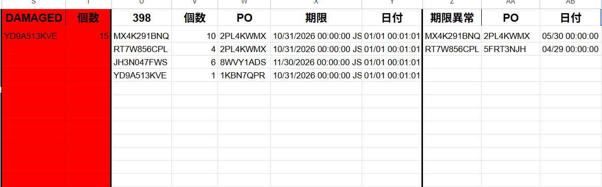

# 受領異常確認ツール

## 概要

受領データをCSVから取り込み、使用期限異常や報告対象商品を自動抽出するツール。  
チェック体制が存在しなかった工程に仕組みを導入し、下流工程での作業停止を予防することを目的として開発した。

---

## 開発背景

- 以前は受領時点での異常チェック体制がなく、棚移動の際に期限データの差異でエラーが発生し、作業が都度停止する問題があった。
- 担当者の気づきに依存している状態から脱却するため、受領時点で異常を検出できる仕組みが必要と判断し開発した。

## 課題

- 棚移動時のエラーで作業が停止することがあった
- 使用期限が短い商品の見落としが、出荷上の問題に直結するリスクがあった
- 確認が担当者個人の気づきに依存しており、基準が統一されていなかった
- ダメージ状態での受領データが混入するケースがあり、見落とすリスクがあった
---

## 実装内容

### CSV取込機能

サイドバーからCSVファイルをドラッグ＆ドロップして取り込み可能。

### 異常データ抽出機能

取り込んだデータから異常商品のみを自動抽出。

### 使用期限チェック機能

使用期限が月末以外の商品を自動検出。  
除外リストを利用し、対象外商品の誤検出を防止。

### 報告対象判定機能

使用期限398日未満の商品を自動判定し、薬剤師への報告対象として抽出。

### ダメージ品検出機能

受領データにダメージ状態のデータが含まれている場合、自動で検出し抽出。
ごく稀に発生するケースも見落とさず検知できるようにした。

---

## 使用技術

| 技術 | 用途 |
|------|------|
| Google Apps Script (GAS) | バックエンド処理・自動化 |
| HTML / JavaScript | サイドバーUI |
| Google Spreadsheet | データ管理・出力 |
| FILTER関数 / Spreadsheet関数 | 異常データ抽出 |

---

## 画面イメージ

---

## 効果

### 作業停止の予防

受領時点で異常を検出できるようになり、棚移動時のエラーによる作業停止を予防。  
「気づいたら対応」から「仕組みで防ぐ」体制へ移行した。

### 品質向上

- 使用期限異常の見落とし防止
- 報告漏れ防止

### 利用状況

- 毎日数時間ごとに運用（1日4〜5回程度）
- 使用期限が短い商品が多発した際には1日数件の異常を検出

---

## 担当範囲

現場業務の課題発見から設計、開発、運用まで一貫して担当。

---

## 工夫した点

ドラッグ＆ドロップのみで操作できるUIにし、誰でも同じ手順で利用できるよう設計した。  
また除外リストを設けることで、実際の運用ルールに合わせた判定を可能にし、誤検出による確認負荷を減らした。
