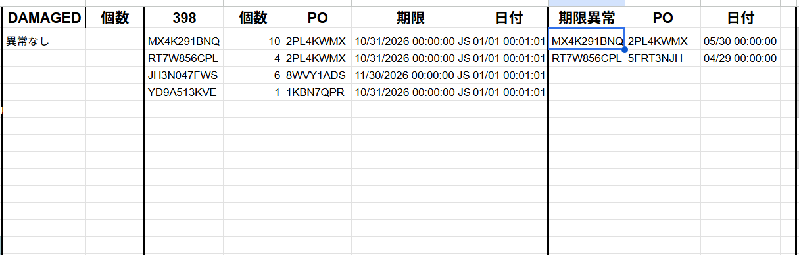

# 受領異常確認ツール

## 概要

受領データをCSVから取り込み、使用期限異常や報告対象商品を自動抽出するツール。  
チェック体制が存在しなかった工程に仕組みを導入し、下流工程での作業停止を予防することを目的として開発した。

---

## 開発背景

以前は受領時点での異常チェック体制がなく、棚移動の際に期限データの差異でエラーが発生し、作業が都度停止する問題があった。  
また使用期限が短い商品は出荷すると重大な問題となるため厳格な確認が必要だったが、担当者の気づきに依存している状態だった。  
そのため、受領時点で異常を検出し、下流工程に問題を持ち込まない仕組みが必要と判断し開発した。

---

## 課題

- 受領時点のチェック体制が存在せず、棚移動時のエラーで作業が停止することがあった
- 使用期限が短い商品の見落としが、出荷上の問題に直結するリスクがあった
- 確認が担当者個人の気づきに依存しており、基準が統一されていなかった

---

## 実装内容

### CSV取込機能

サイドバーからCSVファイルをドラッグ＆ドロップして取り込み可能。

### 異常データ抽出機能

取り込んだデータから異常商品のみを自動抽出。

### 使用期限チェック機能

使用期限が月末以外の商品を自動検出。  
除外リストを利用し、対象外商品の誤検出を防止。

### 報告対象判定機能

使用期限398日未満の商品を自動判定し、薬剤師への報告対象として抽出。

---

## 使用技術

| 技術 | 用途 |
|------|------|
| Google Apps Script (GAS) | バックエンド処理・自動化 |
| HTML / JavaScript | サイドバーUI |
| Google Spreadsheet | データ管理・出力 |
| FILTER関数 / Spreadsheet関数 | 異常データ抽出 |

---

<details>
<summary>📋 報告対象判定（使用期限398日未満の商品）- 判定ロジック（構造概要）</summary>

受領データから以下の条件を複合的に評価し、報告対象商品のみを自動抽出する。

| 条件 | 内容 |
|------|------|
| キー列の存在確認 | 対象データの有無を判定 |
| 区分による除外 | 対象外区分を複数キーで除外 |
| 除外リスト照合 | 運用ルールに基づく対象外商品を除外 |
| 使用期限チェック | 基準日から閾値日数以内の商品を抽出 |
| 除外月チェック | 期限日が月末基準の運用ルールから逸脱しているデータを異常として検出|

```gs
=IFERROR(
  FILTER(
    HSTACK(列1, 列2, 列3, 列4, 日付整形),
    NOT(ISBLANK(キー列)),
    NOT(ISBLANK(判定列)),
    NOT(IFERROR(SEARCH("除外キー1", 区分列, 1), 0)),
    NOT(IFERROR(SEARCH("除外キー2", 区分列, 1), 0)),
    NOT(IFERROR(SEARCH("除外記号", 対象列, 1), 0)),
    LTE(DATEVALUE(TEXT(日付変換式, "yyyy/mm/dd")), 基準日 + 閾値日数),
    NOT(EQ(月抽出式, "除外月")),
    ISNA(MATCH(キー列, 除外リスト, 0))
  ),
  "異常なし"
)
```

</details>

---

<details>
<summary>📋 期限異常検出 - 判定ロジック（構造概要）</summary>

使用期限が月末以外の商品を異常として検出し、除外リストに該当しない商品のみを抽出する。

| 条件 | 内容 |
|------|------|
| 期限列の存在確認 | 期限データの有無を判定 |
| 翌月1日チェック | 翌月1日を期限とする商品を除外 |
| 月末日チェック | 月末以外の期限を異常として検出 |
| 除外リスト照合 | 運用ルールに基づく対象外商品を除外 |

```gs
=IFERROR(
  FILTER(
    HSTACK(列1, 列2, 日付整形),
    NOT(ISBLANK(期限列)),
    NOT(EQ(DATEVALUE(TEXT(日付変換式, "yyyy/mm/dd")), 基準日算出式)),
    NOT(EQ(月抽出式, 月末日抽出式)),
    ISNA(MATCH(キー列, 除外リスト, 0))
  ),
  "異常なし"
)
```

</details>

---

<details>
<summary>📋 DAMAGED検出 - 判定ロジック（構造概要）</summary>

受領データの区分列にDAMAGEDステータスが含まれる商品を自動検出する。

| 条件 | 内容 |
|------|------|
| キー列の存在確認 | 対象データの有無を判定 |
| キーワード検索 | 区分列に特定ステータスが含まれる行を抽出 |

```gs
=IFERROR(
  FILTER(
    HSTACK(列1, 列2),
    NOT(ISBLANK(キー列)),
    SEARCH("検出キーワード", 区分列, 1)
  ),
  "異常なし"
)
```

</details>

---

<details>
<summary>🖥️ CSVアップロードUI（HTML）</summary>

GASサイドバーとして表示されるアップロード画面。ドラッグ＆ドロップとファイル選択の両方に対応する。

```html
<!DOCTYPE html>
<html>
<head>
    <base target="_top">
    <style>
        body {
            font-family: Arial, sans-serif;
            text-align: center;
            margin: 20px;
        }
        h2 {
            color: #333;
        }
        input[type="file"] {
            display: none;
        }
        #fileDropArea {
            margin: 10px;
            padding: 20px;
            border: 2px dashed #ccc;
            background-color: #f8f9fa;
            cursor: pointer;
        }
        #fileDropArea:hover {
            border-color: #007bff;
        }
        button {
            padding: 8px 16px;
            background-color: #007bff;
            color: white;
            border: none;
            cursor: pointer;
        }
        button:hover {
            background-color: #0056b3;
        }
    </style>
    <script>
        function handleFileSelect(event) {
            event.stopPropagation();
            event.preventDefault();
            var files = event.dataTransfer.files || event.target.files;
            for (var i = 0; i < files.length; i++) {
                var file = files[i];
                const fileName = file.name;
                var reader = new FileReader();
                reader.onload = function(e) {
                    google.script.run.withSuccessHandler(processCSVData).processCSVFile(e.target.result, fileName);
                }
                reader.readAsText(file);
            }
        }

        function processCSVData() {
            alert("CSVファイルが処理されました。");
        }

        function handleDragOver(event) {
            event.stopPropagation();
            event.preventDefault();
            event.dataTransfer.dropEffect = 'copy';
        }
    </script>
</head>
<body>
    <h2>CSVファイルをドラッグ&ドロップまたは選択してアップロード</h2>
    <div id="fileDropArea" ondragover="handleDragOver(event)" ondrop="handleFileSelect(event)">
        ドラッグ&ドロップまたはここをクリックしてファイルを選択
    </div>
    <input type="file" id="csvFile" accept=".csv" multiple style="display: none;" onchange="handleFileSelect(event)">
    <button onclick="document.getElementById('csvFile').click()">ファイルをアップロード</button>
</body>
</html>
```

</details>

---

## 画面イメージ





---

## 効果

### 作業停止の予防

受領時点で異常を検出できるようになり、棚移動時のエラーによる作業停止を予防。  
「気づいたら対応」から「仕組みで防ぐ」体制へ移行した。

### 品質向上

- 使用期限異常の見落とし防止
- 報告漏れ防止
- 判定基準の統一（担当者による差異をなくした）

### 利用状況

- 毎日数時間ごとに運用（1日3〜4回程度）
- 短い商品が多発した際には1日数件の異常を検出

---

## 担当範囲

現場業務の課題発見から設計、開発、運用まで一貫して担当。

---

## 工夫した点

ドラッグ＆ドロップのみで操作できるUIにし、誰でも同じ手順で利用できるよう設計した。  
また除外リストを設けることで、実際の運用ルールに合わせた判定を可能にし、誤検出による確認負荷を減らした。
